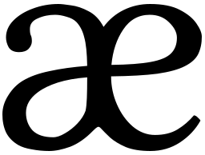

# Aether

An experimental modal text editor with a client–server architecture and tree-sitter integration.

Aether splits editing across two processes: a long-lived server, running locally, holds all
text state — buffer contents, cursors, selections, the undo stack, per-viewport soft wrap — while
thin clients render what the server sends and forward keystrokes. Multiple clients can share a
buffer, see each other's cursors, and share a single undo stack.

## Features

- Modal editing (normal/insert mode)
- Tree-sitter integration (highlighting, indentation, navigation)
- Surround/unsurround, toggle-comment, join and move lines
- Undo and redo stacks for edits and cursor/selection motions
- Fuzzy pickers for files/buffers/projects, file explorer, project-wide grep
- Mouse support, soft wrap, system-clipboard integration

## Keybindings

Type `Space ?` for the in-app overlay. Holding the Shift key extends the selection (e.g., `Shift-w`); a leading
**count** repeats a motion (e.g., `3w`).

### Motions (normal mode)

| Key | Action |
| --- | --- |
| `h`/`l` | Character left/right |
| `j`/`k` | Logical line down/up |
| `Alt-j`/`Alt-k` | Visual row down/up |
| `w`/`b` | Big word forward/backward |
| `Alt-w`/`Alt-b` | Small word forward/backward |
| `e`/`Alt-e` | Big/small word end |
| `0`/`Home` | Logical line start |
| `Alt-l`/`End` | Logical line end |
| `Alt-h` | First non-blank of line |
| `g`/`Alt-g` | Go to line (count, default 1)/last line |
| `d`/`u` | Cursor down/up a page |
| `Alt-d`/`Alt-u` | Cursor down/up half a page |
| `f`/`t` | Find/till character forward (next key is the target) |
| `Alt-f`/`Alt-t` | Find/till character backward |
| `m`/`Alt-m` | Matching bracket/inner matching bracket |
| `]`/`[` | Next/previous navigation unit |
| `}`/`{` | Select to end/start of unit |

### Selection & history (normal mode)

| Key | Action |
| --- | --- |
| `c` | Collapse selection |
| `o` | Swap cursor and anchor |
| `y`/`Alt-y` | Expand/contract selection to syntax node |
| `x`/`Alt-x` | Select line downward/upward |
| `z`/`Alt-z` | Undo/redo cursor motion |
| `r` | Repeat last motion |
| `-` | Center cursor in window |

### Search & grep (normal mode)

| Key | Action |
| --- | --- |
| `/` | Search |
| `Alt-/` | Search for current selection |
| `n`/`Alt-n` | Next/previous match |
| `>`/`<` | Next/previous grep result |
| `Esc` | Clear the active search |

### Editing (Ctrl — shared by normal and insert)

Most Ctrl edits operate in both modes. The clipboard/edit keys are selection-scoped in
normal and line-scoped in insert (since insert has no selection).

| Key | Normal | Insert |
| --- | --- | --- |
| `Ctrl-c` | Change selection | Change line |
| `Ctrl-d` | Delete selection | Delete line |
| `Ctrl-y` | Copy selection | Copy line |
| `Ctrl-x` | Cut selection | Cut line |
| `Ctrl-v` | Paste before selection | Paste at cursor |
| `Ctrl-r` | Replace selection with clipboard | Replace line with clipboard |
| `Ctrl-s` | Surround selection (next key = delimiter) | Surround line |
| `Ctrl-Alt-s` | Unsurround selection | Unsurround line |
| `Ctrl-z`/`Ctrl-Alt-z` | Undo/redo | Undo/redo |
| `Ctrl-l`/`Ctrl-h` | Indent/dedent | Indent/dedent |
| `Ctrl-j`/`Ctrl-k` | Move line(s) down/up | Move line(s) down/up |
| `Ctrl-g` | Join lines | Join lines |
| `Ctrl-t` | Toggle comment | Toggle comment |
| `Ctrl-o`/`Ctrl-Alt-o` | Open line below/above | Open line below/above |
| `Ctrl-p` | Toggle soft wrap | Toggle soft wrap |

### Mode transitions

| Key | Action |
| --- | --- |
| `i`/`a` | Insert at selection start/end |
| `Alt-i`/`Alt-a` | Insert at first line start/last line end |
| `Esc` | Leave insert mode |

### Application commands

| Chord | Action |
| --- | --- |
| `Space f` | Find files |
| `Space b` | Switch buffer |
| `Space g` | Grep workspace |
| `Space e` | File explorer |
| `Space p` | Switch project |
| `Space ,` | Project settings |
| `Space s`/`Space Alt-s` | Save/save as |
| `Space r` | Reload from disk |
| `Space n` | New scratch buffer |
| `Space w` | Close buffer |
| `Space q` | Quit |
| `Space ?` | Show keyboard shortcuts |

## Building

Aether is a standard Cargo workspace.

```sh
cargo build --release
```

This produces two binaries:

- `aether` — the server daemon
- `ae` — the terminal client

## Running

1. **Start the server:**

   ```sh
   aether
   ```

2. **Start the client**, optionally naming a project and a file/directory to open:

   ```sh
   ae                     # start with the project picker open
   ae aether              # open the "aether" project in a scratch buffer
   ae aether src/main.rs  # open a file
   ae aether src/         # open the file explorer at a directory
   ```

   `file` is resolved against the current working directory and must fall within one of the
   project's roots. A directory opens the file browser there.

   Projects are created and managed from the project picker (`Space p`); running `ae` with no
   arguments opens it.

## License

[MIT](LICENSE)
