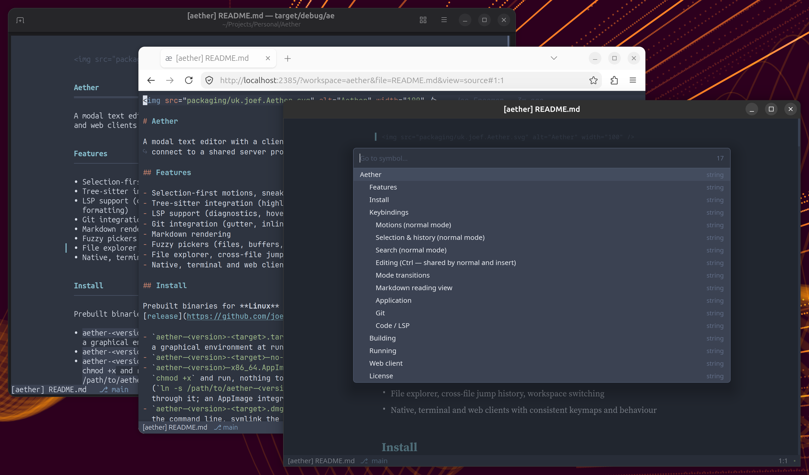

# Aether

A modal text editor with a client–server architecture for Linux and macOS. Native, terminal and web clients connect to a shared server process.



## Features

- Selection-first motions, sneak, surround, transforms, motion undo/redo
- Tree-sitter integration (highlighting, indentation, selection expand/contract)
- LSP support (diagnostics, hover, go-to-definition, references, document/workspace symbols, formatting)
- Git integration (gutter, inline diff, blame, hunk staging)
- Markdown rendering
- Fuzzy pickers (files, buffers, symbols, diagnostics, git changes), workspace grep
- File explorer, cross-file jump history, workspace switching
- Native, terminal and web clients with consistent keymaps and behaviour

## Install

Prebuilt binaries for **Linux** and **macOS** (Apple Silicon) are attached to each
[release](https://github.com/joefreeman/aether/releases).

- `aether-<version>-<target>.tar.gz` — the GUI build. Unpack it and put `ae` on your `PATH`; needs
  a graphical environment at runtime.
- `aether-<version>-<target>-no-gui.tar.gz` — as above, but terminal/web only.
- `aether-<version>-x86_64.AppImage` (**Linux**) — the GUI build as one self-contained executable:
  `chmod +x` and run, nothing to unpack. Symlink it onto your `PATH`
  (`ln -s /path/to/aether-<version>-x86_64.AppImage ~/.local/bin/ae`) and every `ae` command works
  through it; an AppImage integration tool can add the app-menu entry and icon.
- `aether-<version>-<target>.dmg` (**macOS**) — the GUI build as a drag-install `Aether.app`. For
  the command line, symlink the binary it wraps
  (`ln -s /Applications/Aether.app/Contents/MacOS/ae /usr/local/bin/ae`).

> **macOS:** downloads are unsigned, so clear the quarantine flag once —
> `xattr -d com.apple.quarantine ./ae` for a `.tar.gz` binary,
> `xattr -dr com.apple.quarantine /Applications/Aether.app` for the app bundle.

## Keybindings

Type `Space /` for the in-app searchable list. Holding the Shift key extends the selection (e.g.
`Shift-w`); a leading **count** repeats a motion (e.g. `3w`). `Space` is the leader for
app/file/git/code commands, and `Tab` reveals hover info at the cursor.

### Motions (normal mode)

| Key | Action |
| --- | --- |
| `h`/`l` | Character left/right |
| `j`/`Alt-j` | Logical/visual line down |
| `k`/`Alt-k` | Logical/visual line up |
| `w`/`Alt-w` | Select small/big word |
| `b`/`Alt-b` | Small/big word backward |
| `e`/`Alt-e` | Small/big word end |
| `0`, `Home` | Logical line start |
| `Alt-l`, `End` | Logical line end |
| `Alt-h` | First non-blank of line |
| `f`/`Alt-f` | Find character forward/backward (next key is the target) |
| `t`/`Alt-t` | Till character forward/backward |
| `s`/`Alt-s` | Sneak to small/big word (type a prefix, then the label on the word you want) |
| `m`/`Alt-m` | Matching bracket/inner matching bracket |
| `o`/`Alt-o` | Next/previous symbol |
| `p`/`Alt-p` | First non-blank of next/previous line |
| `g`/`Alt-g` | Go to line (count, default 1)/from end (default last) |
| `v`/`Alt-v` | Cursor down/up half a page |
| `Backspace`/`Alt-Backspace` | Jump back/forward (cross-file history) |
| `]`/`[` | Next/previous jumplist entry |
| `}`/`{` | Next/previous jumplist entry in this file |

### Selection & history (normal mode)

| Key | Action |
| --- | --- |
| `,` | Collapse selection |
| `r`/`Alt-r` | Reverse selection (swap cursor and anchor) / orient it forward |
| `%` | Select whole buffer |
| `q`/`Alt-q` | Expand/contract selection to syntax node |
| `x`/`Alt-x` | Select line downward/upward |
| `z`/`Alt-z` | Undo/redo cursor motion |
| `.` | Repeat last motion |
| `;`/`Alt-;` | Cursor near top/bottom of window |

### Search (normal mode)

| Key | Action |
| --- | --- |
| `/` | Search |
| `?` | Search, selecting from the cursor to the match |
| `Alt-/` | Search for current selection |
| `n`/`Alt-n` | Next/previous match |
| `Esc` | Clear the active search |

`Alt-c`/`Alt-w`/`Alt-e` toggle case sensitivity, whole-word and regex matching from the prompt.
`Up`/`Down` recall earlier queries — here and in every other overlay input (grep, globs, paths).

### Editing (Ctrl — shared by normal and insert)

Every Ctrl edit works in both modes. The clipboard/edit keys are selection-scoped in
normal and line-scoped in insert (since insert has no selection), on the same key; the rest are
identical in both.

| Key | Normal | Insert |
| --- | --- | --- |
| `Ctrl-e` | Change selection | Change line |
| `Ctrl-d` | Delete selection | Delete line |
| `Ctrl-c` | Copy selection | Copy line |
| `Ctrl-x` | Cut selection | Cut line |
| `Ctrl-Alt-x` | Cut selection and insert | — |
| `Ctrl-v` | Paste before selection | Paste at cursor |
| `Ctrl-Alt-v` | Replace selection with clipboard | Replace line with clipboard |
| `Ctrl-s` | Surround selection (next key = delimiter) | Surround line |
| `Ctrl-Alt-s` | Unsurround selection | Unsurround line |
| `Ctrl-r` | Transform selection (next key = transform: case styles, invert, reverse, randomise) | Transform identifier under cursor |
| `Ctrl-z`/`Ctrl-Alt-z` | Undo/redo | Undo/redo |
| `Ctrl-l`/`Ctrl-h` | Indent/dedent | Indent/dedent |
| `Ctrl-j`/`Ctrl-k` | Move line(s) down/up | Move line(s) down/up |
| `Ctrl-g` | Join lines | Join lines |
| `Ctrl-Alt-g` | Un-join lines (cursor stays before the break) | Line break at caret, caret stays |
| `Ctrl-a`/`Ctrl-Alt-a` | Increment/decrement number | Increment/decrement number |
| `Ctrl-y`/`Ctrl-Alt-y` | Toggle line/block comment | Toggle line/block comment |
| `Ctrl-f` | Format document | Format document |
| `Ctrl-o`/`Ctrl-Alt-o` | Open line below/above | Open line below/above |

In insert mode, `Tab` indents to the next tab stop and `Backspace` steps back to the previous one,
both following the file's own indent style.

### Mode transitions

| Key | Action |
| --- | --- |
| `i`/`a` | Insert at selection start/end |
| `Alt-i`/`Alt-a` | Insert at first non-blank of line/last line end |
| `Esc` | Leave insert mode |

### Markdown reading view

`Space v` renders the current Markdown buffer — headings, tables, images, links and highlighted
code fences — as a read-only view with its own keys. The reading position *is* the cursor, so
toggling back lands where you were reading.

| Key | Action |
| --- | --- |
| `Space v` | Toggle the reading view |
| `j`/`k` | Focus next/previous element |
| `l`/`h` | Focus next/previous link in the block |
| `o`/`Alt-o` | Next/previous heading |
| `g`/`Alt-g` | First/last element |
| `Enter` | Follow the link, open the image, jump to the footnote, or toggle a task's checkbox |
| `Ctrl-Enter` | Follow a relative link in a new window |
| `Tab` | Show the link's or image's target |
| `x`/`Alt-x`, `Shift-j`/`Shift-k` | Select blocks — as in the editor, plain `x` walks and Shift extends |
| `Ctrl-c` | Copy the selection, the link URL, or the element's Markdown source |
| `Ctrl-z`/`Ctrl-Alt-z` | Undo / redo |
| `i`/`a` | Edit: insert at block/selection start / end |
| `Ctrl-e` | Edit: rewrite the selected block(s) |
| `Ctrl-o`/`Ctrl-Alt-o` | Edit: open a new paragraph below / above |
| `Ctrl-j`/`Ctrl-k` | Move block(s) down / up (`Ctrl-Alt-j`/`k` moves paragraphs in the editor) |
| `Ctrl-x`, `Ctrl-v`/`Ctrl-Alt-v` | Cut block(s); paste as block / replace selection |
| `Ctrl-l`/`Ctrl-h` | Deepen/flatten: heading level, list nesting, or blockquote level |

Search, jump history and the scroll/placement keys behave as they do in normal mode.

### Application

| Chord | Action |
| --- | --- |
| `Space f`/`Space Alt-f` | Find files / in buffer's directory |
| `Space b`/`Space Alt-b` | Switch buffer / new scratch buffer |
| `Space g`/`Space Alt-g` | Grep workspace / for current selection |
| `Space e`/`Space Alt-e` | File explorer / at workspace root |
| `Space w`/`Space Alt-w` | Switch workspace / open file by absolute path |
| `Space j` | Jumplist (`Ctrl-j` in any picker captures its results into it) |
| `Space p`/`Space Alt-p` | Copy relative/absolute path |
| `Space s`/`Space Alt-s` | Save / save as |
| `Space k`/`Space Alt-k` | Keep buffer (toggle transient) / reload from disk |
| `Space x`/`Space Alt-x` | Close buffer / save and close it |
| `Space z` | Open another window |
| `Space ,` | Workspace settings (roots, projects) |
| `Space .` | Application settings (soft wrap, font sizes, …) |
| `Space h`/`Space Alt-h` | Dismiss the current hint / turn hints off |
| `Space q`/`Space Alt-q` | Quit / save current buffer and quit |
| `Space /`/`Space ?` | Show keyboard shortcuts / about this build |

### Git

| Chord | Action |
| --- | --- |
| `c`/`Alt-c` | Next/previous change (hunk) |
| `Space c`/`Space Alt-c` | Git changes in current file / across the workspace (hunks) |
| `Space a`/`Space Alt-a` | Stage-unstage / revert the change under the cursor (or selected lines) |
| `Space i` | Toggle inline diff |
| `Space m` | Blame commit details for the cursor line |

### Code / LSP

| Chord | Action |
| --- | --- |
| `Tab` | Hover (type & docs) |
| `Enter` | Go to definition |
| `Space r` | Go to references |
| `d`/`Alt-d` | Next/previous diagnostic |
| `Space n` | Diagnostic at cursor |
| `Space d`/`Space Alt-d` | Diagnostics: current buffer / workspace |
| `Space o`/`Space Alt-o` | Document / workspace symbols |
| `Space l` | LSP servers (status, restart) |
| `Ctrl-f` | Format document |

## Building

Aether is a standard Cargo workspace.

```sh
cargo build --release
```

This produces a single binary:

- `ae` — runs the server daemon, the terminal client, and (when built with the `gui` feature, on
  by default) the native GUI client. The build that ships the GUI is the default; dropping it with
  `cargo build --release -p aether-ae --no-default-features` (so `iced`/`winit`/`wgpu` never enter
  the dependency graph) is exactly the `-no-gui` release artifact, for a box with no display libraries.

## Running

Just run `ae` — it opens a client and, if no server is already running, auto-starts one in the
background:

```sh
ae                         # open the workspace picker
ae src/main.rs             # open a file (workspace inferred from its path)
ae src/                    # open the file explorer at a directory
ae -w aether               # open the "aether" workspace
ae -w aether src/main.rs   # open a file in a named workspace
```

The first client launches a background server and connects to it; later clients reuse it, and the
server idle-reaps itself once nothing has been connected for a while. To run a persistent server
yourself (e.g. to watch its logs), use `ae server`, and stop it with `ae server stop`.

With no `--gui`/`--tui` flag, `ae` picks a client automatically: a terminal on stdout means the
terminal client; no terminal but a display set (a desktop launcher) means the GUI. Pass `--gui` or
`--tui` to force one.

A `path` is resolved against the current working directory; if it falls outside every configured
workspace it opens as a standalone file. A directory opens the file browser there.

Opening a file that way — `ae file`, with no `-w` — *tethers* the client to that buffer: closing it
(`Space x`, or `Space Alt-x` to save first) exits the client, so `ae` works as an `$EDITOR` for git
and anything else that waits for the process to finish.

Workspaces are created and managed from the workspace picker (`Space w`); running `ae` with no
arguments opens it.

## Web client

The web client is served by the same server process: with a server running, open
<http://127.0.0.1:2384>. There's no token to copy — the daemon is loopback-only and authorizes by
`Host`/`Origin`, so a browser on the same machine just connects.

Building from source needs its bundle built once (`web/`, TypeScript):

```sh
cd web
npm install     # first time only
npm run build   # tsc (typecheck + compile), then Vite bundles to web/dist
```

Release builds embed `web/dist` in the binary, so a released `ae` is self-contained; debug builds
read it from disk, so a rebuilt bundle is served without restarting the server.

## License

[MIT](LICENSE)
